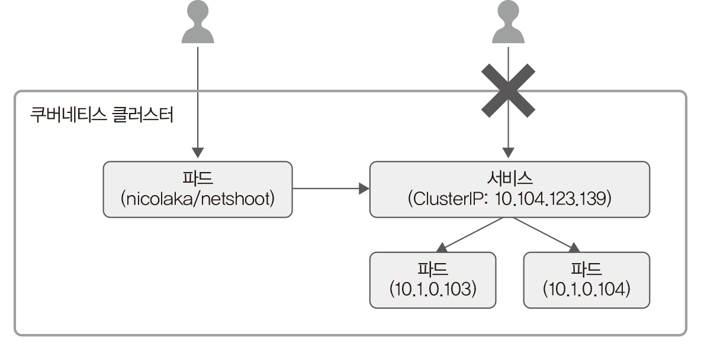
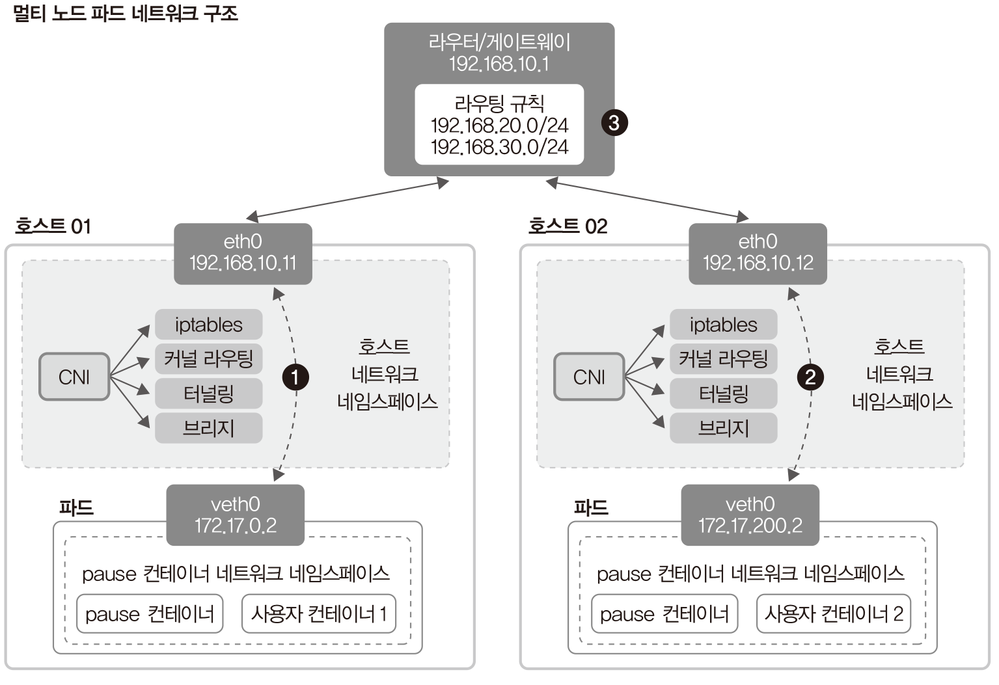
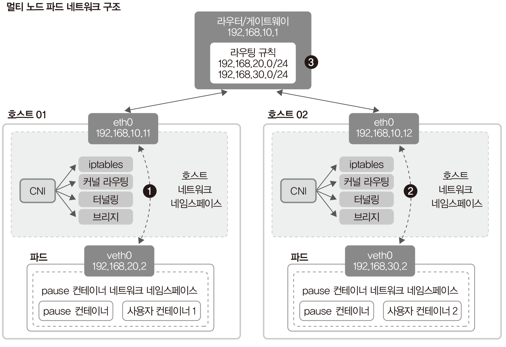

# 1쇄 오탈자 정리

### 26쪽 목차
13.1.1 kubectl의 config 파일에 있는 **TSL** 인증 정보 구조 확인하기

→

13.1.1 kubectl의 config 파일에 있는 **TLS** 인증 정보 구조 확인하기

### 97쪽 3.2.1 명령
`kubectl run nginx-app --image nginx --port=80`

→

`kubectl  create  deployment nginx-app --image nginx`

단, 쿠버네티스 1.18 이후 사용자만 해당 정오표를 반영하기 바랍니다.

### 102쪽 그림 3-4 다음 행
서비스 타입에는 ClusterIP, NodePort, LoadBalancer, ExteralName이 → 서비스 타입에는 ClusterIP, NodePort, LoadBalancer, **ExternalName**이

### 177쪽 마지막 줄 명령 실행 결과

AME → NAME

### 180쪽 6.5.3 두 번째 문단

`.spec.containers[].env[]` → `.spec.template.spec.containers[].env[]`

### 201쪽 그림 7-2 CludterIP 타입 서비스의 구조

전체구조 설명에 명시된 IP 정보들이 202페이지의 describe 정보와 일치해야합니다.

서비스Pod(ClusterIP: 10.105.216.244) / 파드(10.1.1.196) / 파드(10.1.1.197)
→
서비스Pod(ClusterIP: 10.104.123.139) / 파드(10.1.0.103) / 파드(10.1.0.104)

### 210쪽 두 번째 문단 마지막 줄
DNS 시스템은 ExteralName 타입의 → DNS 시스템은 **ExternalName** 타입의

### 259쪽 10.2 제목 아래 문단

[코드 10-2]는 컨피그맵의 일부 설정만 불러오는 디플로이먼트와 **NodePoret** 타입 서비스가 포함된 템플릿의 예입니다.

→

[코드 10-2]는 컨피그맵의 일부 설정만 불러오는 디플로이먼트와 **NodePort** 타입 서비스가 포함된 템플릿의 예입니다.

### 310쪽 13.1.1 제목
kubectl의 config 파일에 있는 **TSL** 인증 정보 구조 확인하기

→

kubectl의 config 파일에 있는 **TLS** 인증 정보 구조 확인하기

### 311쪽 첫 번째 문단
그동안 kubectl을 설치한 후 별다른 문제없이 명령어들을 사용할 수 있었던 이유는 kubectl 설정에 **TSL** 인증 정보가 포함되었기 때문입니다.

→

그동안 kubectl을 설치한 후 별다른 문제없이 명령어들을 사용할 수 있었던 이유는 kubectl 설정에 **TLS** 인증 정보가 포함되었기 때문입니다.

### 312쪽 맨 아래 점 스타일 2개 문장

* name.client-certificate-data: 클라이언트 인증에 필요한 해시값을 설정합니다. 여기에서는 **TSL** 인증 기반의 해시값을 설정했습니다.
* name.client-key-data: 클라이언트의 키 해시값을 설정합니다. 여기에서는 **TSL** 인증 기반의 해시값을 설정했습니다.

→

* name.client-certificate-data: 클라이언트 인증에 필요한 해시값을 설정합니다. 여기에서는 **TLS** 인증 기반의 해시값을 설정했습니다.
* name.client-key-data: 클라이언트의 키 해시값을 설정합니다. 여기에서는 **TLS** 인증 기반의 해시값을 설정했습니다.

### 365쪽 그림 15-4

변경 전

변경 후

##  382쪽 점스타일 설명 중 수정
proxy → forward

### 487쪽 세 번째 문단 수정
21.5에서 수정했던 msql 차트를 → 21.5에서 수정했던 **mysql** 차트를

# 2쇄 오탈자 정리

## 312쪽 맨 아래 점 스타일 2개 문장

* user.client-certificate-data: 클라이언트 인증에 필요한 해시값을 설정합니다. 여기에서는 TLS 인증 기반의 해시값을 설정했습니다.
* user.client-key-data: 클라이언트의 키 해시값을 설정합니다. 여기에서는 TLS 인증 기반의 해시값을 설정했습니다.

→

* **name**.client-certificate-data: 클라이언트 인증에 필요한 해시값을 설정합니다. 여기에서는 TLS 인증 기반의 해시값을 설정했습니다.
* **name**.client-key-data: 클라이언트의 키 해시값을 설정합니다. 여기에서는 TLS 인증 기반의 해시값을 설정했습니다.

## 394쪽 다섯 번째 문단 첫 번째 줄
이제 `kubectl get podts -n kube-system` 명령을 → 이제 `kubectl get pods -n kube-system` 명령을

## 487쪽 두 번째 문단
`curl --data-binary "@mysql-0.1.0.tgz" http://localhost:8080/api/charts` 명령을 → `curl --data-binary "@mysql-0.1.1.tgz" http://localhost:8080/api/charts` 명령을
